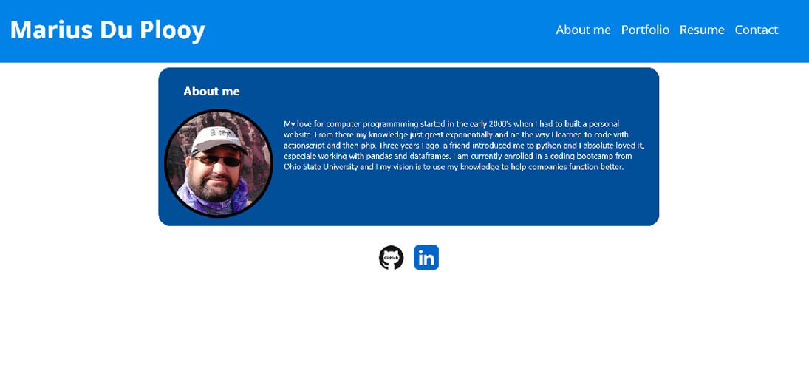

# Profile website with React

## Description

This project challenged me to create a profile website with React.

During this project I learned how to use:

- vite to start a react project
- components to build a reat website.
- css styles with react components
- create a client side and server side.
- react to build forms and add custome validation.
- useState's in React to interact and create dynamic content.
- routes in react.
- deploy an app on Netlify.

## Link to website

https://mariusprofile.netlify.app

## Installation

- clone the repository
- run npm install
- run npm start
- open the app on http://localhost:3000/

## Usage

This app provides an easy and accessible interface for a potential employer to see my profile.

## Screenshot of website

## Credits: Resources used

I used and modified code from the following resources:

https://www.youtube.com/watch?v=3PDQDRJq5Ls

https://www.youtube.com/watch?v=j942wKiXFu8&list=PL4cUxeGkcC9gZD-Tvwfod2gaISzfRiP9d

https://www.shecodes.io/athena/38787-how-to-import-and-loop-through-local-images-in-a-react-component

## License

MIT
